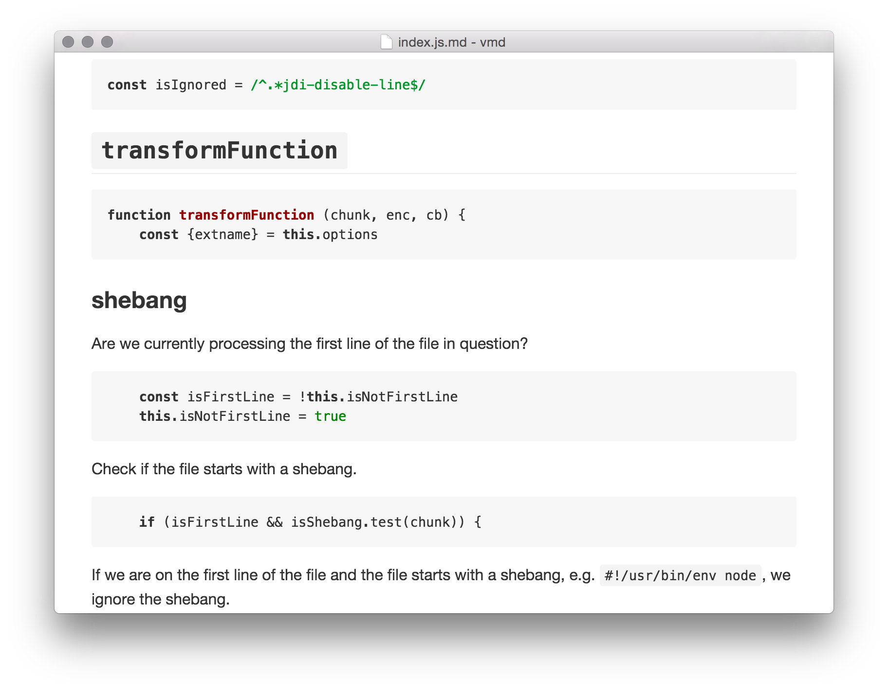
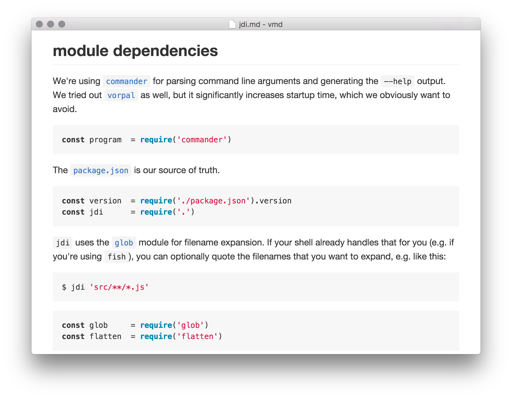

# `jdi`

[](https://travis-ci.org/alexanderGugel/jdi)
[](https://github.com/alexanderGugel/jdi)
[](https://www.npmjs.com/package/jdi)

**jdi** is a documentation generator for JavaScript. You give it some source
files (e.g. via `jdi index.js`) and it generates corresponding `.md` files from
your comments (e.g `index.js.md`).

Inspired by the concepts of [Literate programming], it encourages you to heavily
document your code using [Markdown].

> Let us change our traditional attitude to the construction of programs:
> Instead of imagining that our main task is to instruct a computer what to do,
> let us concentrate rather on explaining to human beings what we want a
> computer to do.
> — <cite>[Donald E. Knuth, Literate Programming]</cite>

## Example

`jdi` is documented using `jdi`. Checkout [`index.js.md`](./index.js.md) and
[`jdi.md`](./jdi.md) for an example. You can view the documentation via the
GitHub web interface or using a Markdown previewer / editor, such as
[`vmd`](https://www.npmjs.com/package/vmd):





## Motivation

Let's face it: The majority of JSDoc comments are completely useless and a waste
of time for the author, as well as the reader.

We shouldn't (just) document **what** a particular piece of code does, instead
we should focus on why it *does what it does*. Reading source code should be
more like reading a guide, as opposed to reading a manual.

I think literate programming is a wonderful concept, but I don't think
introducing a separate format for programs written in "literate" form is the
right way to go. Instead we should continue extracting documentation from source
code, but the comments should build "frame" around your code.

## Installation

The recommended way to install [`jdi`](https://www.npmjs.com/package/jdi) is
via [`npm`](https://www.npmjs.org/):

   ```sh
   npm i jdi -g
   ```

`-g` installs `jdi` globally, so it can be used from the command line.
Alternatively you can install `jdi` locally as a `devDependency`:

   ```sh
   npm i jdi --save-dev
   ```

## Usage

Using `jdi` is trivial. Just some source files to it and it will happily create
corresponding Markdown documents:

```sh
jdi **/*.js
```

```
~/r/jdi (master) $ jdi --help

  Usage: jdi [options]

  Options:

    -h, --help     output usage information
    -V, --version  output the version number
```

`jdi` supports globbing. If you want glob to perform the expansion on a system
where the shell already does that (e.g. when using `fish` shell), quote the file
arguments:

```sh
jdi '**/*.js'
```

**Protip:** Use a `Makefile` for keeping your `.md` files in-sync with your
source files:

```make
%.md: %
	@./node_modules/.bin/jdi $<
```

```sh
~/r/jdi (master) $ make index.js.md
wrote 6385 bytes to index.js.md
```

But after the initial run, no further `.md` files will be built:

```sh
~/r/jdi (master) $ make index.js.md
make: `index.js.md' is up to date.
```

## Programmatic usage

You can also `require('jdi')` and use the public API directly.

### Prior works of art

* [Docco](https://jashkenas.github.io/docco/) is quite similar, but instead of
  generating Markdown files, it generates HTML. Since everyone has their
  favorite Markdown editor anyways, I don't see any reason to actually render to
  generated Markdown to HTML (even though that would be trivial).
* [literate-programming](https://github.com/jostylr/literate-programming) is
  deprecated. It also extracts code from your Markdown documents as opposed to
  extracting Markdown from your source code. While this is closer to the
  *original* idea behind literate programming, I don't think introducing an
  additional build step is the way to go.

### License

See [`LICENSE`](./LICENSE).

[Donald E. Knuth, Literate Programming]: http://www.literateprogramming.com/knuthweb.pdf
[Literate programming]: https://en.wikipedia.org/wiki/Literate_programming
[Markdown]: https://github.com/adam-p/markdown-here/wiki/Markdown-Cheatsheet
